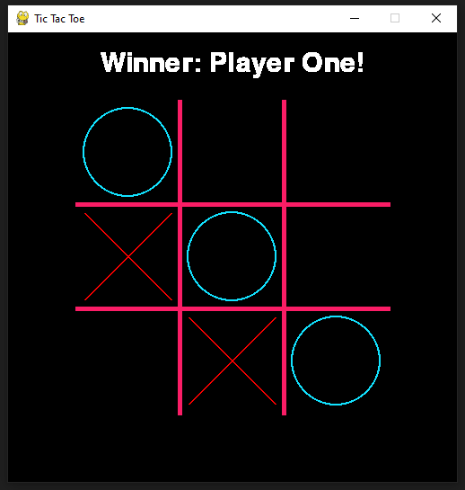

# Tic-Tac-Toe_Pygame
Tic Tac Toe developed on Python 3.10.0 and Pygame 2.0.3

Just a little project. I made this for fun a few time ago while learning Pygame. Sorry for the messy code, I'm aware that it can be improved.

Controls:

  - In menu:
    - Arrows: Left or Right
    - Enter: Accept
    
  - In game:
    - Mouse: Click to make your move
    - Enter: Press to play a new game when the actual game is done
    
## Screenshot

